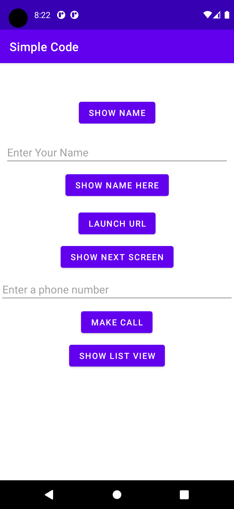
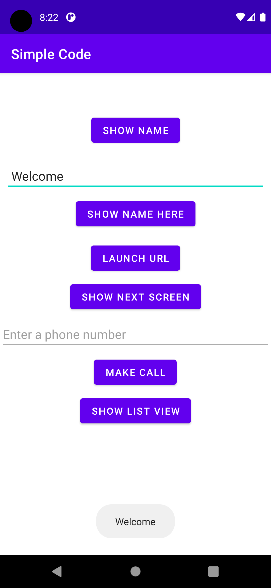
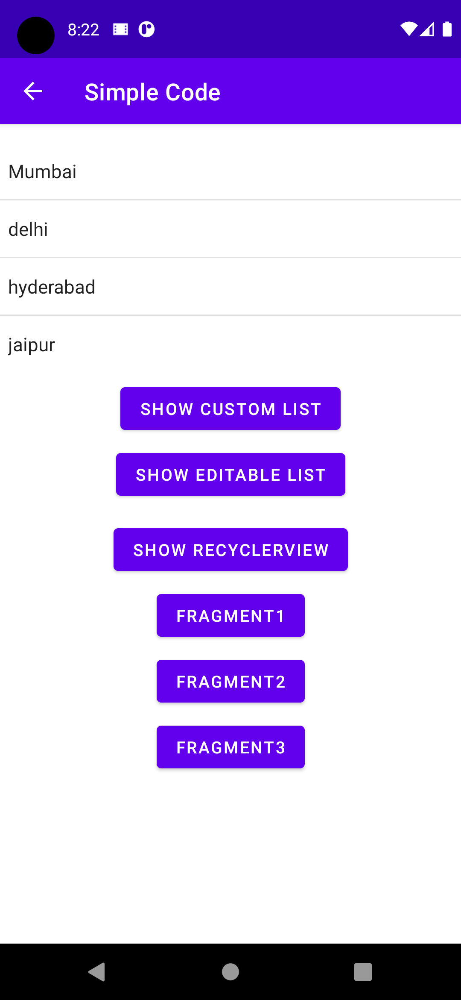
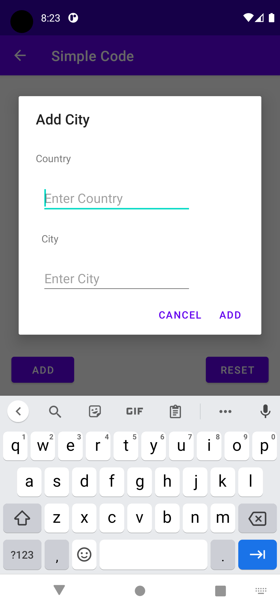
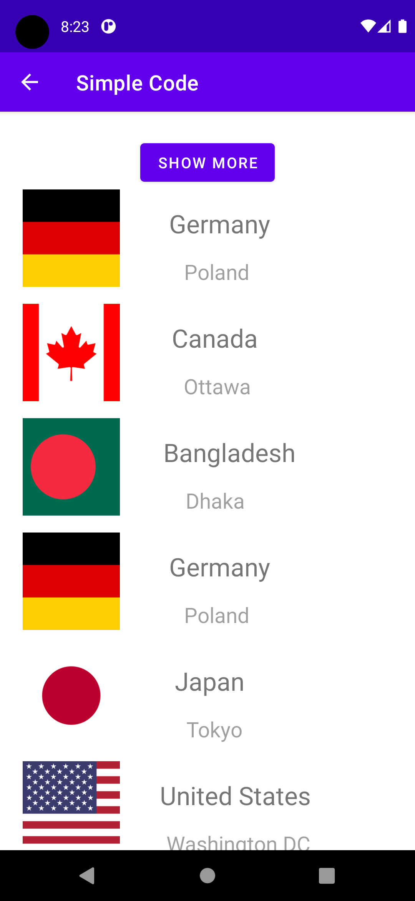
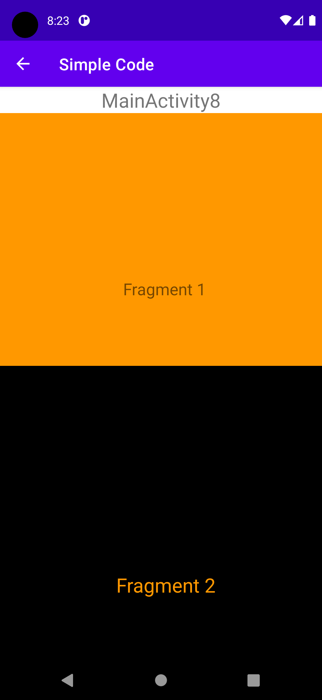
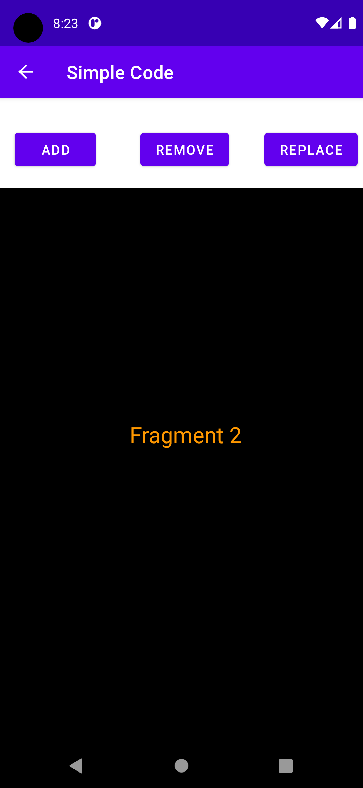

# Basics_of_Android
All the basics of android which a starter need to know !!
It contains :
	         simple name toogling with a button
           enter data along with its type 
           Toast making 
           Next screen with data passing
	         Implicit intent
           Permission for opening url 
           And also phone number permission to make call
           List view , add ,reset ,list view(both inbuilt layout, custom layout) 
	         Shared prefs, Gson
           Recycler view along with its optimisation
	         Fragments
           Data passing between fragment and activity
           Add and remove replace a fragment
           Addtobackstack along with animation.
# Happy Coding :D 

